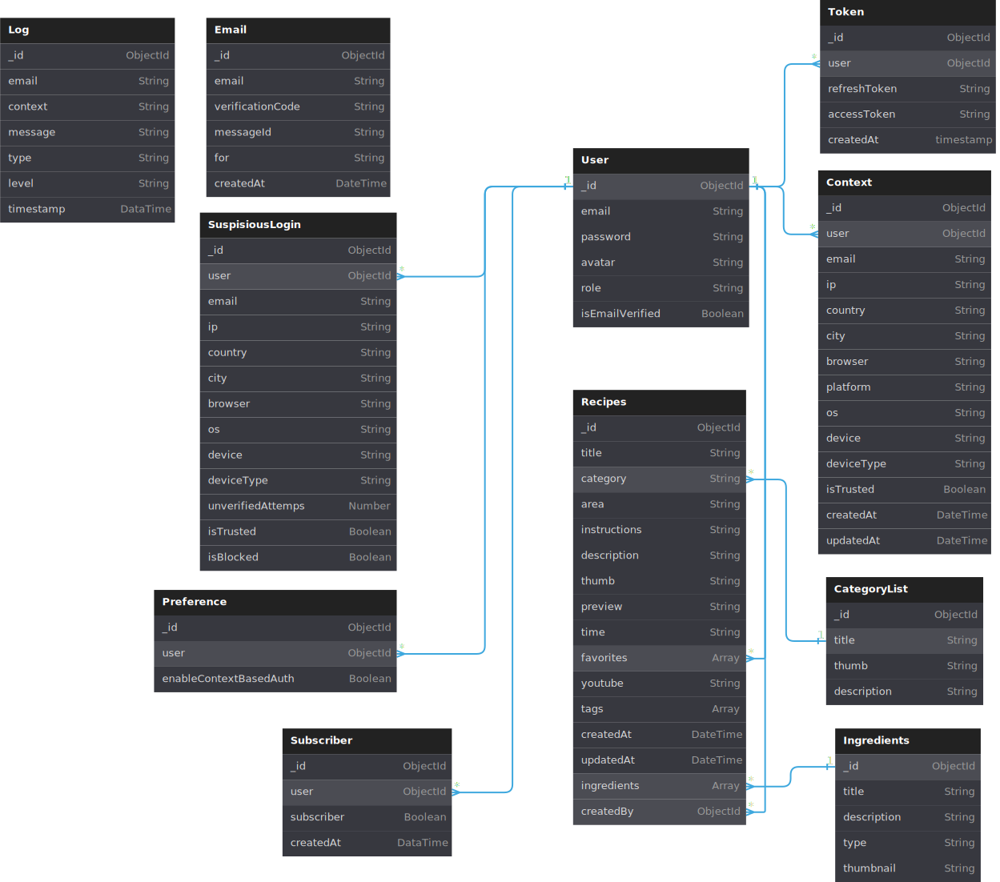

# Server

- [Technologies](#technologies)
- [Configuration .env](#configuration-env)
- [Schema Diagram](#schema-diagram)
- [Models](#models)
    - [Model User](#model-user)
    - [Model Token](#model-token)
    - [Model Email](#model-email)
    - [Model Context](#model-context)
    - [Model SuspiciousLogin](#model-suspiciouslogin)
    - [Model Subscriber](#model-subscriber)
    - [Model Preference](#model-preference)
    - [Model Log](#model-log)

## Technologies
The server uses various technologies. Here are some of them:

- TypeScript
- Node.js
- Express.js
- MongoDB
- JWT Authentication
- Bcrypt
- Nodemailer
- Swagger
- Morgan
- Passport
- Crypto-js

## Configuration .env
To run the server, you need to create a `.env` file in the `server` directory. This file should contain the following environment variables:

- `CLIENT_URL`: link URL
- `MONGO_URI`: URI to your MongoDB database. It should look something like this: `mongodb+srv://<username>:<password>@cluster0.mongodb.net/<dbname>?retryWrites=true&w=majority`
- `SECRET`: Secret used for signing access tokens. It should be a long, random string.
- `REFRESH_TOKEN`: Secret used for signing refresh tokens. It should be a long, random string.
- `EMAIL_SERVICE`: Name of the email service you want to use for sending emails (e.g., 'gmail').
- `FROM_EMAIL`: Email address from which you want to send emails.
- `EMAIL_PASSWORD`: Password for the email account from which you want to send emails.
- `CRYPTO_KEY`: Key used for encrypting and decrypting data. It should be a long, random string.

## Schema Diagram

## Models
The server consists of various models that are used for structuring and manipulating data. Here are the main models used in the application.

## Model User

The `User` model is used for storing information about users. It has the following fields:

- `email`: User's email address. This is a field of type `string`.
- `passwords`: User's password. This is a field of type `string`.
- `avatar`: User's avatar. This is a field of type `string`.
- `roler`: User's role. This is a field of type `string`.
- `savedPosts`: User's saved posts. This is a field of type `string`.
- `isEmailVerified`: Field indicating whether the user's email has been verified. This is a field of type `boolean`.

## Model Token

The `Token` model is used for storing information about tokens. It has the following fields:

- `user`: Reference to the user who owns this token. This is a field of type `mongoose.Schema.Types.ObjectId`.
- `refreshToken`: Refresh token. This is a field of type `string`.
- `accessToken`: Access token. This is a field of type `string`.
- `verificationToken`: Verification token. This is a field of type `string`.
- `createdAt`: Date and time when the token was created. This is a field of type `Date`.

## Model Email

The `Email` model is used for storing information about emails. It has the following fields:

- `email`: Email address. This is a required field of type string.
- `verificationCode`: Verification code. This is a unique and required field of type string.
- `messageId`: Message ID. This is a required field of type string.
- `for`: Destination field. This is a required field of type string.
- `createdAt`: Date and time when the email was created. This is a field of type `Date` with a default value of `Date.now`. This field expires after 1800 seconds.

## Model Context

The `Context` model is used for storing information about user context. It has the following fields:

- `user`: Reference to the user who owns this context. This is a required field of type `mongoose.Schema.Types.ObjectId`.
- `email`: User's email address. This is a required field of type string.
- `ip`: User's IP address. This is a required field of type string, which is encrypted before saving and decrypted after retrieval.
- `country`: User's country. This is a required field of type string, which is encrypted before saving and decrypted after retrieval.
- `city`: User's city. This is a required field of type string, which is encrypted before saving and decrypted after retrieval.
- `browser`: User's browser. This is a required field of type string, which is encrypted before saving and decrypted after retrieval.
- `platform`: User's platform. This is a required field of type string, which is encrypted before saving and decrypted after retrieval.
- `os`: User's operating system. This is a required field of type string, which is encrypted before saving and decrypted after retrieval.
- `device`: User's device. This is a required field of type string, which is encrypted before saving and decrypted after retrieval.
- `deviceType`: User's device type. This is a required field of type string, which is encrypted before saving and decrypted after retrieval.
- `isTrusted`: Field indicating whether the context is trusted. This is a required field of type boolean with a default value of true.
- `createdAt`: Date and time when the context was created. This is a field of type `Date` managed automatically by Mongoose.
- `updatedAt`: Date and time of the last update to the context. This is a field of type `Date` managed automatically by Mongoose.

## Model SuspiciousLogin

The `SuspiciousLogin` model is used for storing information about suspicious login attempts. It has the following fields:

- `user`: Reference to the user who attempted to log in. This is a required field of type `mongoose.Schema.Types.ObjectId`.
- `email`: Email address used for the login attempt. This is a required field of type string.
- `ip`: IP address used for the login attempt. This is a required field of type string.
- `country`: Country from which the login attempt originated. This is a required field of type string.
- `city`: City from which the login attempt originated. This is a required field of type string.
- `browser`: Browser used for the login attempt. This is a required field of type string.
- `platform`: Platform used for the login attempt. This is a required field of type string.
- `os`: Operating system used for the login attempt. This is a required field of type string.
- `device`: Device used for the login attempt. This is a required field of type string.
- `deviceType`: Type of device used for the login attempt. This is a required field of type string.
- `unverifiedAttempts`: Number of unverified login attempts. This is a field of type number with a default value of 0.
- `isTrusted`: Field indicating whether the login attempt is trusted. This is a field of type boolean with a default value of false.
- `isBlocked`: Field indicating whether the login attempt is blocked. This is a field of type boolean with a default value of false.

## Model Subscriber

The `Subscriber` model is used for storing information about subscribers. It has the following fields:

- `user`: Reference to the user who is a subscriber. This is a required field of type `mongoose.Schema.Types.ObjectId`.
- `subscriber`: Field indicating whether the user is a subscriber. This is a required field of type Boolean.
- `createdAt`: Date and time when the subscription was created. This is a field of type `Date` with a default value of `Date.now`.

## Model Preference

- `user`: Reference to the user for whom the preferences are saved. This is a unique and required field of type `mongoose.Schema.Types.ObjectId`.
- `enableContextBasedAuth`: Field indicating whether context-based authentication is enabled. This is a field of type Boolean with a default value of false.

## Model Log

The `Log` model stores application logs. Each log has an associated email address, context (which is encrypted and decrypted), message, type, level, and timestamp. There is also a method for decrypting the log context.

- `email`: Email address associated with the log. This is an optional field of type String.
- `context`: Log context. This is a required field of type String. The value of this field is encrypted using the `encryptField` function and decrypted using the `decryptField` function.
- `message`: Log message. This is a required field of type String.
- `type`: Log type. This is a required field of type String.
- `level`: Log level. This is a required field of type String.
- `timestamp`: Log creation timestamp. This is a required field of type Date with a default value of `Date.now`. This field expires after 604800 seconds (1 week).
- `decryptContext`: Method for decrypting the log context. Returns the decrypted value of the context.
